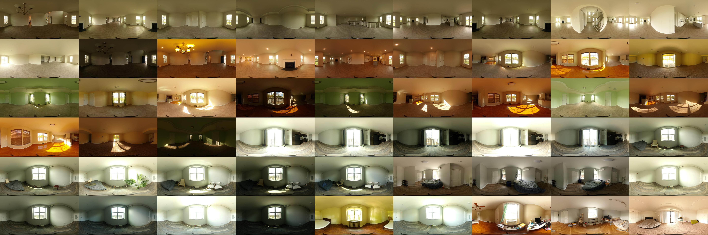
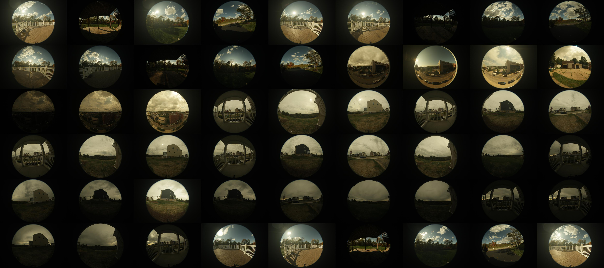

# Cali-HDR-Dataset
Calibrated HDR (Cali-HDR) dataset includes 137 indoor panoramas and paired real-time outdoor fisheye images.

This dataset is contributed by the oral presentation paper "Virtual Home Staging: Inverse Rendering and Editing an Indoor Panorama under Natural Illumination" at the International Symposium on Visual Computing, Lake Tahoe, NV, Oct. 16-18, 2023. 

The complete dataset is available upon request. 
To access the download link, please email Guanzhou Ji (gji@andrew.cmu.edu). 

## Indoor Panorama

## Outdoor Fisheye

## Dataset Summary
[Click here to view the dataset summary](Cali-HDR_data.pdf)

## BibTeX
@inproceedings{ji2023virtual,
    title = {Virtual Home Staging: Inverse Rendering and Editing an Indoor Panorama under Natural Illumination},\
    author = {Ji, Guanzhou and Sawyer, Azadeh 0. and Narasimhan, Srinivasa G.},\
      booktitle = {International Symposium on Visual Computing, Lake Tahoe, NV},\
      year = {2023},
  }
